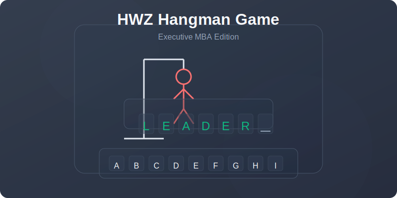

# 🎮 HWZ Hangman Game

<div align="center">



```
  +---+
  |   |
  O   |    H W Z - H A N G M A N
 /|\  |    
 / \  |    Executive MBA Edition
      |
=========
```

Ein modernes, interaktives Hangman-Spiel mit einer hochwertigen Glassmorphism-Benutzeroberfläche, speziell entwickelt für den Executive MBA (EMBA) der HWZ.

[](https://hwz-hangman.vercel.app)
[](https://nextjs.org/)
[](https://www.typescriptlang.org/)
[](https://tailwindcss.com/)

</div>

## ✨ Features

<table>
  <tr>
    <td width="50%">
      <h3>🎯 Klassisches Hangman mit EMBA-Twist</h3>
      <ul>
        <li>Errate Buzzwords aus dem Executive MBA-Kontext</li>
        <li>Drei progressive Hinweise pro Wort</li>
        <li>Intuitive Spielmechanik</li>
      </ul>
    </td>
    <td width="50%">
      <h3>🎨 Modernes UI-Design</h3>
      <ul>
        <li>Glassmorphism-Effekte mit halbtransparenten Elementen</li>
        <li>Responsive für Desktop und Mobile</li>
        <li>Animierte Übergänge und Effekte</li>
      </ul>
    </td>
  </tr>
  <tr>
    <td width="50%">
      <h3>🚀 Cutting-Edge Technologien</h3>
      <ul>
        <li>Next.js 14 mit App Router</li>
        <li>TypeScript für Typsicherheit</li>
        <li>Framer Motion für flüssige Animationen</li>
      </ul>
    </td>
    <td width="50%">
      <h3>🔌 Offline-Fähig</h3>
      <ul>
        <li>Keine externen Abhängigkeiten</li>
        <li>Läuft vollständig im Browser</li>
        <li>Keine Serveranbindung notwendig</li>
      </ul>
    </td>
  </tr>
</table>

## 🎯 Spielregeln

```
1️⃣ Ein zufälliges Buzzword aus dem EMBA-Kontext wird ausgewählt
2️⃣ Rate Buchstaben, um das Wort zu entschlüsseln
3️⃣ Nutze die Hinweise, wenn du Hilfe benötigst (3 Stufen verfügbar)
4️⃣ Jeder falsche Buchstabe bringt dich näher an die Niederlage
5️⃣ Gewinne, indem du alle Buchstaben errätst, bevor der Hangman fertig ist
```

## 📚 Buzzword-Beispiele

<div align="center">

| Buzzword | Beschreibung |
|----------|--------------|
| VUCA | Volatilität, Unsicherheit, Komplexität und Ambiguität |
| DISRUPTION | Grundlegende Veränderung bestehender Geschäftsmodelle |
| LEADERSHIP | Die Kunst, Menschen zu inspirieren und zu führen |
| PURPOSE | Der tiefere Sinn eines Unternehmens jenseits des Profits |
| AGILITÄT | Fähigkeit, schnell und flexibel auf Veränderungen zu reagieren |

</div>

## 🛠️ Technologien

- **React & Next.js**: Für komponentenbasierte UI-Entwicklung und optimale Performance
- **TypeScript**: Für Typsicherheit und bessere Entwicklererfahrung
- **TailwindCSS**: Für schnelles und konsistentes Styling
- **Framer Motion**: Für flüssige Animationen und Übergänge
- **Zustand**: Für einfaches State Management
- **shadcn/ui**: Für hochwertige UI-Komponenten

## 🚀 Installation und Start

```bash
# Repository klonen
git clone https://github.com/muraschal/hwz-hangman.git
cd hwz-hangman

# Abhängigkeiten installieren
npm install

# Entwicklungsserver starten
npm run dev

# Für Produktionsbuilds
npm run build
npm start
```

## 🔄 Erweiterbarkeit

- Die Buzzword-Liste kann einfach in der JSON-Datei erweitert werden
- Das modulare Design ermöglicht einfache Anpassungen und Erweiterungen
- Potenzielle zukünftige Features:
  - Highscore-System
  - Multiplayer-Modus
  - Kategorien für Buzzwords

## 📝 Lizenz

Dieses Projekt ist unter der [MIT-Lizenz](LICENSE) lizenziert.

## 👥 Beitragende

- [Marcel Rapold](https://github.com/muraschal)

---

<div align="center">

Entwickelt für die HWZ - Hochschule für Wirtschaft Zürich | Executive MBA Programm

```
  O   
 /|\  Viel Spaß beim Spielen!
 / \  
```

</div> 